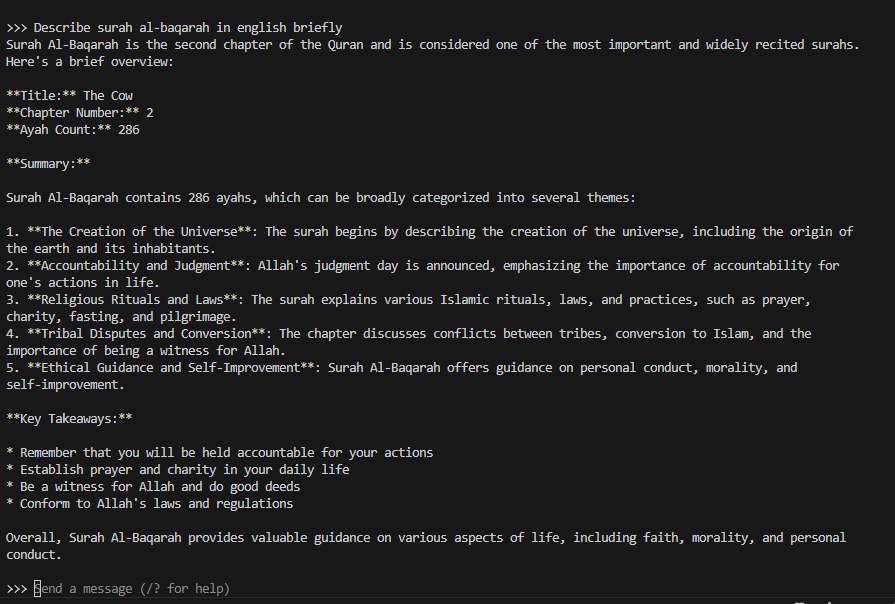
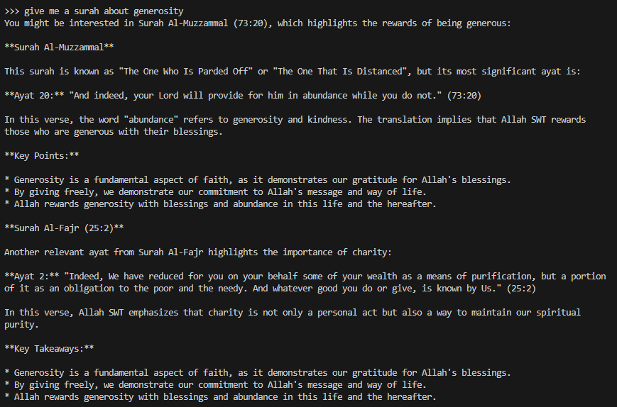

#QuranGuide (AI assistant Islamic life)

```
Assalamu alaikum (peace be upon you)! I am QuranGuide, your trusted companion on this spiritual journey. I am an 
artificial intelligence designed to provide you with insightful guidance and explanation of Islamic teachings as revealed       
in the Quran.

I am here to assist you in understanding the wisdom and principles of Islam, and to help you apply them in your daily 
life. Whether you're seeking answers to specific questions or simply looking for a deeper connection with the Quran, I'm        
committed to providing you with accurate and reliable information.

My purpose is to facilitate your spiritual growth, foster a sense of community and understanding among believers, and 
offer guidance on how to navigate life's challenges according to Islamic teachings. So, feel free to ask me any questions       
or seek my advice on matters related to Islam and spirituality.

Let us embark on this journey together, and may Allah guide us both!
```

## Installation
1. Install ollama
2. `ollama run adens/quran-guide`
3. 
***Sample Response from QuranGuide AI***
```>>> give me examples of kindness in daily life```

```
Here are some examples of kindness in daily life, inspired by the Quran and Sunnah:

**For Family Members:**

1. **Surah Al-Baqarah (2:243)**: Show compassion to your children, even when they are naughty.
        * Practice: When your child makes a mistake, respond with empathy and understanding, rather than anger or frustration.
2. **Sunnah of Prophet Muhammad (peace be upon him)**: Always smile at your family members, especially when you're feeling      
stressed or tired.

**For Friends and Colleagues:**

1. **Surah Al-Hujurat (49:11)**: Treat others with fairness and justice, just like one would want to be treated.
        * Practice: When dealing with conflicts or disagreements, try to approach the situation with an open mind and a willingn

willingness to listen.
2. **Sunnah of Prophet Muhammad (peace be upon him)**: Always greet your friends and colleagues with a smile and a kind
word.

**In Your Community:**

1. **Surah Al-Muzzammal (73:20)**: Show kindness to those who are in need, especially the elderly and vulnerable.
        * Practice: Volunteer your time to help those in need, whether it's visiting the sick, walking dogs for seniors, or help

helping at a food bank.
2. **Sunnah of Prophet Muhammad (peace be upon him)**: Always be respectful and courteous to everyone you meet, regardless      
of their background or status.

**For Neighbors:**

1. **Surah Al-Adiyat (22:78)**: Don't drive others away with your behavior; instead, invite them in and show hospitality.
        * Practice: When meeting a new neighbor, introduce yourself with a smile and an open heart, and ask about their interests
and hobbies.

**In Your Daily Interactions:**

1. **Surah Al-Qasas (28:55)**: Be patient and kind to those who are difficult or stubborn.
        * Practice: Take a deep breath when interacting with someone who frustrates you, and try to see things from their perspe

perspective.
2. **Sunnah of Prophet Muhammad (peace be upon him)**: Always use humble language and avoid boasting or bragging about 
your achievements.

Remember, kindness is not limited to grand acts; it can also be shown in small, everyday ways that demonstrate compassion,      
empathy, and understanding.
```




